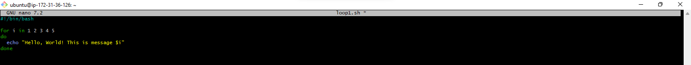
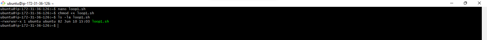
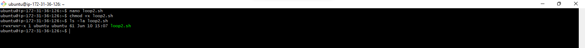
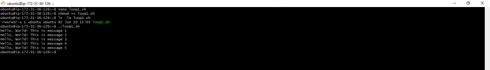
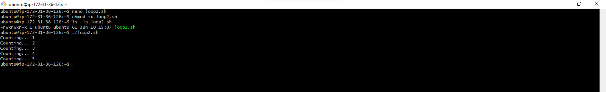

# Control-Flow-in-Shell-Scripting

Control flow statements are the backbone of decision making in programming. In scripting, these statements lets your scripts decide what to do or how to proceed based on conditions, loops or user inputs.

Bash and other shell interpreters provides control flow statements like :
* _**if-else**_
* _**for**_ loops
* _**while loops**_ and
* _**case**_ statements to control the flow of execution in your scripts.

## What is Control flow?

In simple terms, control flow directs the order in which commands or instructions are executed in a script. It's like a roadmap that decides which path to take based on certain conditions or how manyt times to visit a place.

## Loops

Loops are fundamental constructs that allow us to repeat a set of commands multiple times. Some real world scenarios where loops are inevitable includes;
* Batch Processing
* Data analysis and
* Automated testing

In Bash scripting, there are three primary types of loops that are commonly used to repeat a set of commands multiple times based on certain commands.
1. For
2. While and
3. Until

### For Loop

The For Loop is used to iterate over a list of values or a range of numbers. It is useful especially when you know the number of times you need to execute the loop body. The For Loop can be written in two syntax;
1. ```
   #!/bin/bash
   for i in 1 2 3 4 5
   do
     echo "Hello, World! This is message $i"
   done
   ```

2. ```
   #!/bin/bash
   for i in {"1..5"}
   do
     echo "Counting... $i"
   done
   ```

### Task

In this task, the focus will be on For Loops

1. Create a shell script for each types of for loop and insert the code in file

   
   _**Fig.1**_: Script created for the first type of For Loop

   
   _**Fig.2**_: Script created for the second type of For Loop

2. Set the correct permissions for the scripts

   
   _**Fig.3**_: Set execution permission for first type of For Loop created.

   
   _**Fig.4**_: Set execution permission for the second type of For Loop created

3. Execute the scipts and evaluate your experience

   
   _**Fig.5**_: Execute the first type of For Loop

   
   _**Fig.6**_: Execute the second type of For Loop
