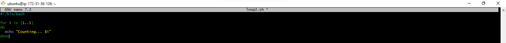

# Control Flow and Error Handling in Shell Scripting

Control flow statements are the backbone of decision making in programming. In scripting, these statements lets your scripts decide what to do or how to proceed based on conditions, loops or user inputs.

Bash and other shell interpreters provides control flow statements like :
* _**if-else**_
* _**for**_ loops
* _**while loops**_ and
* _**case**_ statements to control the flow of execution in your scripts.

## What is Control flow?

In simple terms, control flow directs the order in which commands or instructions are executed in a script. It's like a roadmap that decides which path to take based on certain conditions or how manyt times to visit a place.

## Loops

Loops are fundamental constructs that allow us to repeat a set of commands multiple times. Some real world scenarios where loops are inevitable includes;
* Batch Processing
* Data analysis and
* Automated testing

In Bash scripting, there are three primary types of loops that are commonly used to repeat a set of commands multiple times based on certain commands.
1. For
2. While and
3. Until

### For Loop

The For Loop is used to iterate over a list of values or a range of numbers. It is useful especially when you know the number of times you need to execute the loop body. The For Loop can be written in two syntax;
1. ```
   #!/bin/bash
   for i in 1 2 3 4 5
   do
     echo "Hello, World! This is message $i"
   done
   ```

2. ```
   #!/bin/bash
   for i in {"1..5"}
   do
     echo "Counting... $i"
   done
   ```

### Task

In this task, the focus will be on For Loops

1. Create a shell script for each types of for loop and insert the code in file

   
   _**Fig.1**_: Script created for the first type of For Loop

   
   _**Fig.2**_: Script created for the second type of For Loop

2. Set the correct permissions for the scripts

   
   _**Fig.3**_: Set execution permission for first type of For Loop created.

   
   _**Fig.4**_: Set execution permission for the second type of For Loop created

3. Execute the scipts and evaluate your experience

   
   _**Fig.5**_: Execute the first type of For Loop

   
   _**Fig.6**_: Execute the second type of For Loop

## Error Handling in Shell Scripting

Error handling is a crucial aspect of shell scripting that involves anticipating and managing errors that may occur during script execution. Some of these errors may arise due to problems with User inputs validation, unexpected system behaviour, or resource unavailability. When implementing error handling in shell scripting, it's essential to consider different scenarious and develop strategies to handle them accordingly. 

Some of these strategies innclude;
* Identifying Potential Errors
* Using Conditional Statements
* Providing Informative Messages

### Handling S3 Bucket Existence Error

In our script, we have createed an s3 buxket but an error could arise if the bucket already exists. Below is an updated version of the _**create_s3_buckets**_ function with errror handling for existing buckets:

```
# Function to create S3 buckets for different departments
create_s3_buckets() {"\n    company=\"datawise\"\n    departments=(\"Marketing\" \"Sales\" \"HR\" \"Operations\" \"Media\")\n    \n    for department in \"${departments[@]"}"; do
        bucket_name="${company}-${department}-Data-Bucket"**
        
        # Check if the bucket already exists
        if aws s3api head-bucket --bucket "$bucket_name" &>/dev/null; then
            echo "S3 bucket '$bucket_name' already exists."
        else
            # Create S3 bucket using AWS CLI
            aws s3api create-bucket --bucket "$bucket_name" --region your-region
            if [ $? -eq 0 ]; then
                echo "S3 bucket '$bucket_name' created successfully."
            else
                echo "Failed to create S3 bucket '$bucket_name'."
            fi
        fi
    done
}

```

The _**aws s3api head-bucket**_ command was used to check if the bucket already exists. If it does exist, a message is displayed indicating its presence. otherwise, the script proceeds to create the bucket as before. This prevent errors and ensure existing buckets are not created repeatedly.
